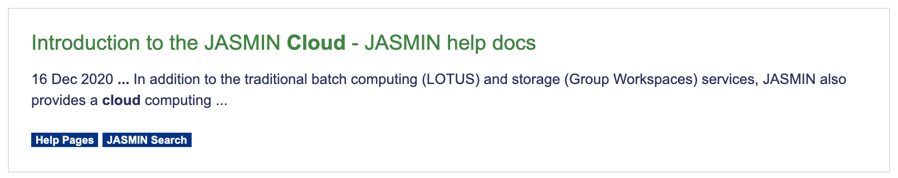

# Bootstrap Google Custom Search

Uses google custom search [api callbacks](https://developers.google.com/custom-search/docs/element#imageweb-search-results-ready-callback) to modify how the results are displayed
to make use of [bootstrap](https://getbootstrap.com/). This uses [mustache templating](https://github.com/janl/mustache.js/).

## Getting started

Make sure you have your mustache template somewhere you can access. Example included.

### The \<head>
Bootstrap css is not provided by the code snippets, you will need to make sure you have included some
css in the head of your page. This allows you to set your styling.

The example below uses the CEDA Archive custom bootstrap css:

```html
<!-- CEDA Archive Styling -->
<link rel="stylesheet" href="https://artefacts.ceda.ac.uk/themes/orgtheme_ceda_serv/0.2/4/flatly/bootstrap.css" media="screen">
```

To use the the mustache templates, you need to include the mustache js

```html
<script src="https://unpkg.com/mustache@4.1.0"></script>
```

The [callback](js/result_bootstrap_mustache.js), either copy the file or cut and paste the function into your own then include it on the page:
```html
<script src="path/to/callback/function.js"></script>
```

Then you need to register the callback function:

```html
    <script>
        <!-- Specify the location for the results mustache template -->
        gcs_results_template = 'templates/bootstrap_results.html'

        window.__gcse || (window.__gcse = {});
        window.__gcse.searchCallbacks = {
            web: {
                ready: bootstrapResultsReadyCallback,
            },
        };
    </script>
```

### The \<body>

In the body, you just need the Google custom search engine results element:

```html
<div class="gcse-searchresults-only">
```

Refinements can either be made on the GCSE console or using [data attributes](https://developers.google.com/custom-search/docs/element#supported_attributes) to the div.


## Example code

The example takes a query parameter in the url and uses that to make a search.
The results are then displayed with the chosen bootstrap css. In the header
there are the CEDA themes which can be uncommented to change the styling.

The URL query parameter needed to make a search is `gsc.q=`

## Templates

### [bootstrap_results.html](templates/bootstrap_results.html)

Uses a basic bootstrap card with the labels as badges. Shown here with the JASMIN theme:


